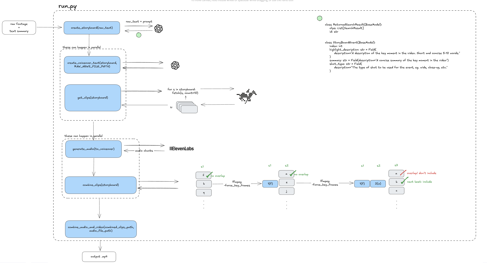

# News Video Generator

Automatically generates news video clips from raw video footage using twelvelabs and openai.

https://github.com/user-attachments/assets/78ebe6ce-1603-4613-b315-fe7075e95a2b

## Requirements

- Python 3.11.11+
- [uv](https://astral.sh/uv) or pip

## Installation

```bash
git clone https://github.com/kingsotn-twelve/tl-news-shorts.git
cd tl-news-shorts
```

install dependencies

```bash
# using uv
uv venv && source .venv/bin/activate
uv pip install -r requirements.txt

# using pip
python -m venv .venv && source .venv/bin/activate
pip install -r requirements.txt
```

enter api keys in .env file, you can find the keys here:

- [twelvelabs key](https://playground.twelvelabs.io/dashboard/api-key)
- [elevenlabs key](https://elevenlabs.io/app/settings/api-keys)
- [openai key](https://platform.openai.com/api-keys)

```toml
TWELVELABS_API_KEY=<your_twelvelabs_api_key>
ELEVENLABS_API_KEY=<your_elevenlabs_api_key>
OPENAI_API_KEY=<your_openai_api_key>
```

rename example.env to .env

```bash
mv example.env .env
```

## Usage

The script requires a locally downloaded video file specified in `LOCAL_VIDEO_PATH` to avoid slow ffmpeg processing of streaming HLS formats.

```python
# Set the values in project_config.py:

# project name
PROJECT = "250219_nif_ndby_LKW_Crash"
# path to the local video file
LOCAL_VIDEO_PATH = "~/Downloads/12labs/250219_nif_ndby_LKW_Crash/250219_News5_LKW_Crash_A3_1.mp4"
# path to the raw news file
RAW_NEWS_FILE_PATH = "~/Downloads/12labs/250219_nif_ndby_LKW_Crash/translated_raw.txt"
# id of the twelvelabs index
TWELVELABS_INDEX_ID = "67cf4c17c14a54d6e58d1388"
# id of the twelvelabs video
TWELVELABS_VIDEO_ID = "67cf69a8f45d9b64a583534c"

```

run the script

```bash
python run.py
```

## Walkthrough



1. `create_storyboard` analyzes news text with gpt-4o to create a structured storyboard object. e.g:

```python
# example storyboard for a car accident

storyboard = StoryBoard(
    location="A3, Wörth an der Donau, Germany",
    storyboard=[
        StoryBoardEvent(
            index=1,
            highlight_description="Accident site with overturned truck",
            summary="The camera pans over the site showing the overturned truck and emergency services.",
            shot_type="Wide shot",
        ),
        StoryBoardEvent(
            index=2,
            highlight_description="First responders in action",
            summary="Emergency services are seen attending to the injured truck driver and clearing the scene.",
            shot_type="Close-up",
        ),
        StoryBoardEvent(
            index=3,
            highlight_description="Truck driver being rescued",
            summary="Focus on the rescue operation for the trapped truck driver by first responders.",
            shot_type="Medium shot",
        ),
        StoryBoardEvent(
            index=4,
            highlight_description="Hazardous materials team at work",
            summary="Specialized team dealing with the chemical spill from the overturned truck.",
            shot_type="Medium shot",
        ),
    ],
)
```

2. `create_voiceover_text` generates voiceover script from storyboard data using openai
3. `get_clips` queries twelvelabs api with visual/audio search to find matching video segments:

- the code gathers 10 clips in descending order of their match score, and saves them to CACHED_SEARCH_TO_CLIPS

4. `combine_clips` extracts clips using ffmpeg with keyframe alignment and concatenates them:

   - creates unique clips for each storyboard event, avoiding time overlaps
   - uses ffmpeg with `-force_key_frames` to ensure clean cuts at precise timestamps
   - limits clips to 6 seconds maximum for consistency
   - generates a concat list file and uses ffmpeg's concat demuxer to join clips
   - preserves video quality with codec copy during concatenation

5. `generate_audio` converts text to speech via elevenlabs' multilingual model
6. `combine_audio_and_video` mixes audio tracks (0.05 volume for original, 1.0 for voiceover) and combines with video
